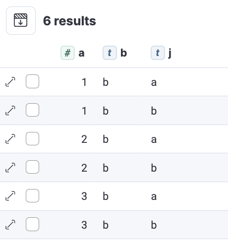

La Nueva Frontera en Análisis de Datos

Descubriendo el Poder de ES|QL

*Por* Customer Architect Team

© Customer Architect Team

Conoce al Equipo de Arquitectos de Cliente (CA), tu aliado estratégico
en el universo Elasticsearch. Estamos aquí para asegurar el éxito con
Elasticsearch y que obtengas el máximo provecho de cada característica.

Te presentamos este Handbook esencial sobre ES|QL. Este manual no solo
facilita tu introducción a ES|QL, sino que también te ayudará a
optimizar tus procesos de analítica de datos. Nuestro objetivo es claro:
hacer que ES|QL sea accesible, comprensible y valioso para ti.

Prepárate para transformar tu enfoque analítico con la guía experta del
Equipo de CA.

<https://www.elastic.co>

A todo el equipo de Elasticsearch: su pasión, dedicación y conocimiento
son la columna vertebral de este libro.

Gracias por convertir cada página en un reflejo de nuestra colaboración
y compromiso con la excelencia.

Juntos, seguimos construyendo más que soluciones, construimos
posibilidades.

# Prólogo

En un mundo donde los datos no solo abundan sino que fluyen con una
velocidad vertiginosa, la necesidad de comprender, procesar y extraer
valor de ellos nunca ha sido tan crucial. Elasticsearch ha emergido como
una solución líder, ofreciendo un poder y una flexibilidad sin
precedentes en el manejo de datos. Sin embargo, como toda herramienta
poderosa, desbloquear su verdadero potencial requiere conocimiento,
habilidad y, lo más importante, una guía confiable.

Es aquí donde este Handbook sobre ES|QL entra en escena. Concebido desde
la experiencia colectiva del equipo de Elasticsearch, este libro no es
solo un compendio de instrucciones; es una brújula en el vasto paisaje
de la analítica de datos. A través de sus páginas, ES|QL se revela no
solo como un lenguaje de consulta, sino como un puente hacia una
comprensión más profunda y un manejo más eficiente de sus datos.

Este Handbook es un testimonio de nuestra dedicación no solo a la
excelencia tecnológica, sino también al éxito y crecimiento de nuestros
usuarios. Cada capítulo, cada ejemplo, cada consejo, se ha diseñado con
un propósito: empoderar a quienes lo leen para que no solo ejecuten
consultas, sino que también desaten el potencial total de sus datos.

Nos embarcamos en este viaje sabiendo que cada conjunto de datos cuenta
una historia, cada consulta desbloquea un misterio, y cada insight puede
ser el comienzo de algo extraordinario. Que este Handbook sea tu
compañero en este viaje, iluminando tu camino, enriqueciendo tu
comprensión y, finalmente, transformando tu relación con los datos.

Bienvenido a una nueva era de análisis de datos. Bienvenido al mundo de
ES|QL.


# Introducción a ES|QL

En la vanguardia de la tecnología de consultas en Elasticsearch,
ES|QL brinda una interfaz de consulta sofisticada y potente que
transciende los métodos convencionales de análisis de datos. Este
lenguaje de consultas, ofrece a los usuarios un medio mas intuitivo y
directo para interactuar con sus datos, proporcionando capacidades de
filtrado, análisis y transformación sin precedentes. Con su diseño
centrado en el usuario, ES|QL demuestra ser una herramienta esencial
para quienes buscan profundizar en la compresión de sus datos y obtener
insights valiosos de manera eficaz.

## Descripción General

Elasticsearch Query Language, es una poderosa herramienta diseñada para
filtrar, transformar y analizar datos almacenados en Elasticsearch. Este
lenguaje y motor de cómputo se caracteriza por su facilidad de
aprendizaje y uso, lo que o hace accesible para una amplia gama de
usuarios, incluyendo equipos como los SRE, desarrolladores y
administradores.

Una de las características distintivas de ES|QL es el uso de “pipes” (|)
que permite manipular y transformar datos de manera secuencial. Esto
posibilita la composición de una serie de operaciones donde el resultado
de una se convierte en la entrada de la siguiente, facilitando así
transformación de datos complejas y análisis detallados.

Además, ES|QL va más allá de ser simplemente un lenguaje de consulta, es
un nuevo motor de cómputo dentro de Elasticsearch. A diferencia de otros
lenguajes de consulta, las expresiones ES|QL no se transpiran a Query
DSL para su ejecución, sino que son ejecutadas directamente dentro de
Elasticsearch, lo que contribuyen a su alto rendimiento y versatilidad.

El motor de ejecución de ES|QL ha sido diseñado con el rendimiento en
mente, operando en bloques en lugar de por fila, enfocándose en la
vectorización y localidad de caché, y aprovechando la especialización y
el multi-threading. Este enfoque asegura que ES|QL sea extremadamente
eficiente en la realización de búsquedas, agregaciones y funciones de
transformación.

## Fundamentos de ES|QL

Diseñadlo para ofrecer una experiencia de consulta avanzada y altamente
eficiente. Esta sección busca desentrañar los principios fundamentales
de ES|QL, proporcionando una base sólida para aquellos que buscan
explorar sus capacidades.

La naturaleza declarativa de ES|QL:

ES|QL es un lenguaje declarativo, lo que significa que se enfoca en el
"qué" más que en el "cómo" de la manipulación de datos. Los usuarios
especifican el resultado deseado sin detallar los pasos exactos
necesarios para obtenerlo, permitiendo que el sistema optimice y
determine el proceso más eficiente.

Sintaxis Basada en Pipes:

La sintaxis de ES|QL se centra en el uso de "pipes" (|), un enfoque que
permite encadenar múltiples comandos para transformar y analizar datos.
Este método promueve la legibilidad y facilita la construcción de
consultas complejas, dividiéndolas en pasos secuenciales y manejables.

Composición de Consultas:

ES|QL permite la composición de consultas a través de una serie de
comandos y funciones. Cada comando procesa los datos y pasa el resultado
al siguiente comando en la cadena. Esta estructura facilita la
realización de operaciones complejas de filtrado, agregación y
transformación de datos.

Integración profunda con Elasticsearch:

A diferencia de otros lenguajes de consulta, ES|QL está profundamente
integrado con Elasticsearch. Las consultas se ejecutan directamente
dentro de Elasticsearch, aprovechando su infraestructura distribuida y
capacidades de indexación para proporcionar resultados rápidos y
precisos.

Rendimiento y Optimización:

El motor de ejecución de ES|QL está diseñado para alto rendimiento.
Operando en bloques y no por fila, se enfoca en la vectorización y
localidad de caché. Además, el motor aprovecha la especialización y el
multi-threading para optimizar las operaciones de consulta.

Flexibilidad y Extensibilidad:

ES|QL no solo se adapta a una amplia variedad de casos de uso sino que
también ofrece la flexibilidad necesaria para extender y personalizar
consultas. Soporta una gama de comandos y funciones, y se adapta a
distintas necesidades de análisis y procesamiento de datos.

## La Infraestructura Computacional de ES|QL

En el corazón de Elasticsearch, la infraestructura computacional de
ES|QL se destaca como un pilar fundamental, proporcionando la robustez
necesaria para manejar y procesar vastos conjuntos de datos con una
eficiencia encomiable. Esta avanzada infraestructura se beneficia
enormemente de la arquitectura distribuida de Elasticsearch, permitiendo
un escalado eficiente y una rápida ejecución de consultas. Más que solo
procesamiento, el motor de ES|QL es sinónimo de inteligencia y
adaptabilidad; está dotado con mecanismos avanzados para la optimización
dinámica de consultas, ajustando las operaciones en tiempo real para
garantizar un procesamiento de datos que no solo es rápido sino también
increíblemente eficiente.

Pero la versatilidad de ES|QL no termina ahí. Con un soporte extensivo
para operaciones avanzadas, desde windowing hasta el análisis de series
temporales, ES|QL se presenta como una herramienta excepcionalmente
adaptable y poderosa, adecuada para una diversidad de escenarios y
necesidades analíticas. Esta versatilidad se ve aún más enriquecida por
su estrecha integración con herramientas de visualización como Kibana,
lo que permite a los usuarios no solo indagar en sus datos sino también
dar vida a los insights a través de representaciones visuales
intuitivas. Este enfoque holístico se ve reforzado por el compromiso
constante del equipo de Elasticsearch con la mejora y actualización de
ES|QL, asegurando que esta herramienta no solo esté a la vanguardia en
términos de rendimiento y características sino que también permanezca
en sintonía con las dinámicas cambiantes del mundo de los datos.

# Primeros pasos con ES|QL

**I**niciar en el mundo de ES|QL es una aventura emocionante que
comienza con la preparación y configuración adecuada del entorno. Antes
de sumergirse en las profundidades de este lenguaje de consulta, es
fundamental asegurarse de que todas las piezas necesarias estén en su
lugar. Esto incluye tener una instancia de Elasticsearch operativa y
familiarizarse con las interfaces a través de las cuales ES|QL será
utilizado, como Kibana o la API REST de Elasticsearch. Esta etapa
inicial es crucial para garantizar un recorrido sin contratiempos en el
análisis de datos con ES|QL.

¿Listo para sumergirte en el mundo de ES|QL y ver lo que tus datos
pueden hacer realmente? Crea tu cuenta gratuita en Elasticsearch Cloud
dede https://ela.st/startnow.

Una vez que el entorno está listo, ¡es hora de jugar, experimentar y
descubrir\! los primeros pasos en ES|QL. Esto implican conocer su
sintaxis única, dominar una variedad de comandos específicos, y entender
cómo trabajar con funciones y operadores. Además, es crucial
familiarizarse con los campos de metadatos y cómo manejar campos
multivalor. Aprender a procesar datos con herramientas como Grok y
Dissect, y a enriquecer datos son también partes fundamentales de este
aprendizaje. Cada aspecto es crucial para aprovechar la potencia de
ES|QL en Elasticsearch para el análisis de datos complejos.

Sintaxis:

La sintaxis de ES|QL se centra en una estructura basada en pipes (|) que
guía el flujo de datos a través de diversas operaciones, facilitando una
construcción lógica y secuencial de consultas. Esta metodología permite
a los usuarios ejecutar transformaciones complejas y análisis de datos
de manera intuitiva y eficiente. Por ejemplo, una consulta puede
comenzar con una extracción de datos usando FROM, seguida de una serie
de filtros y transformaciones como WHERE, GROUP BY, y ORDER BY, cada uno
conectado por un pipe para una ejecución fluida y ordenada.

Ejemplo:

```
FROM apache-logs 

| WHERE url.original ==
<span dir="rtl">‘</span>/login<span dir="rtl">’</span> 

| EVAL time\_buckets = auto\_bucket (@timestamp,
50,”2023-09-11T21:54:05.000Z”,”2023-09-12T00:40:35.000Z”)

| STATS login\_attempts = count(user.name) by time\_buckets, user.name

| SORT login\_attempts desc
```

En este ejemplo podemos ver como seleccionamos el índice ‘apache-logs’
filtrando aquellos mensajes que contienen ‘/login’, evaluamos los datos
comprendidos entre dos puntos temporales, repartiéndolos en 50
‘buckets’, contando los eventos identificados agrupándolos por
usuario para finalmente ordenarlos de forma descendente.

Como resultado obtendríamos algo parecido a
esto:

Aunque esto representa un ejemplo, nos muestra un caso de uso de
seguridad que aporta mucho valor.

Mas adelante iremos profundizando en los casos de usos y ejemplos que
nos permitan profundizar poco a poco en esta aventura con ES|QL.

# Casos de uso de ES|QL

En el capitulo anterior donde realizamos una introducción de ES|QL y
su sintaxis, vimos un ejemplo práctico en un caso de seguridad, donde
pudimos evaluar los logins de nuestros usuarios.

En este capitulo veremos los tres casos de uso principales de ES|QL,
aunque estamos seguro que podrás aplicarlos a otros muchos.

## Observabilidad

Conocido como ‘o11y’ para abreviar, ES|QL nos ayudará visualizando y
analizando datos dentro de Elasticsearch.

Directamente desde la barra de búsqueda, puedes agregar, transformar,
calcular y buscar tus métricas, registros y trazas con una sola consulta
para optimizar la identificación de cuellos de botella de rendimiento y
problemas del sistema, reduciendo el tiempo de resolución.

ES|QL introduce capacidades avanzadas como la definición de campos en el
momento de la consulta, búsquedas para el enriquecimiento de datos y
procesamiento de consultas concurrente, mejorando la velocidad y
eficiencia.


## Seguridad

Mejora tu postura de seguridad, acelera los flujos de trabajo de SecOps
y mejora la precisión de las alertas, sin importar la fuente y
estructura de los datos.

ES|QL permite búsquedas rápidas y flexibles, definición de nuevos campos
al vuelo, agregación de resultados, y visualización de patrones
significativos, todo desde una única consulta.

Incorpora valores agregados en las reglas de detección para alertar con
mayor precisión y reducir la fatiga de alarmas, proporcionando más
señales y menos ruido.

Enriquece los datos proporcionando un contexto adicional crucial para
investigaciones de seguridad, como la localización geográfica de una
dirección IP y su asociación con entidades maliciosas, el usuario y su
grupo…, todo desde una sola barra de
búsqueda.


## Búsqueda

Eleva tus capacidades de búsqueda, los desarrolladores encontrarán en
ES|QL una experiencia de codificación y consulta simplificada, lo que se
traduce en ahorros significativos de tiempo y costos.

ES|QL no solo facilita un mayor entendimiento sobre los datos —qué
contienen, cómo organizarlos y cómo solucionar problemas— sino que
también optimiza las tareas al consolidarlas en una única consulta
procesable de manera concurrente, lo que mejora el rendimiento y reduce
el Costo Total de Operación (TCO), permitiendo lograr más con menos..

Esta eficiencia se logra sin sacrificar la profundidad o la calidad del
análisis, ofreciendo una solución integral para la manipulación de
datos.


# Sintaxis de ES|QL

En este capítulos nos centraremos en la sintaxis de ES|QL e iremos
profundizando poco a poco en el entendimiento y aprendizaje.

En líneas generales ES|QL está compuesto de un “source-command” seguido
(opcionalmente) de una serie de
“processing-commands”

Aunque todo se puede poner en una única línea, podemos apilarlo ara
facilitar la lectura.

Identificadores

Son nombres usados para identificar elementos como capos. Pueden usase
tal cual, excepto si contienen caracteres especiales, en cuyo caso deben
estar entre comillas invertidas (‘**\`**’).

Literales

Representan valores fijos en las consultas, soportando tanto numéricos
como de cadena de texto. Estos últimos deben ir entre comillas dobles
(‘**“**‘) y los números pueden ser enteros, decimales o en notación
científica.

Comentarios

Se permite añadir notas o desactivar partes del código, para ello usamos
‘**//**’ para comentarios de una sola línea o ‘**/\* … \*/**’ para
comentarios en bloque.

Intervalos de fecha y hora

Los podemos expresar mediante literales de intervalo, combinando un
número con un calificador de tiempo como ‘days’, ’hours’, etc. y se
pueden usar para especificar duraciones o periodos de tiempo.

Lista de calificadores compatibles:

# Comandos de ES|QL

Existen dos categorías de comandos en ES|QL, los denominados
<span dir="rtl">“</span>source” y los
<span dir="rtl">“</span>processing”.

Source commands

Estos comandos producen tablas y son el inicio de cualquier consulta,
estando soportados:

FROM

ROW

SHOW

Processing commands

Estos procesan y modifican la entrada recibida añadiendo, eliminado o
cambiando las filas o columnas, estando soportados:

DISSECT

DROP

ENRICH

EVAL

GROK

KEEP

LIMIT

MV\_EXPAND

RENAME

SORT

STATS … BY

WHERE

A continuación iremos profundizando en cada uno de ellos. en capítulos
posteriores veremos ejemplos prácticos.

FROM

Con ello especificamos la fuente de datos para la consulta, como un
índice o alias y retorna una tabla respetando documentos, con filas y
columnas correspondientes a documentos y campos.

FROM kibana\_sample\_data\_ecommerce

ROW

Nos permite genera una fila con una o más columnas con los valores
concreto. Esto puede resultar útil para realizar pruebas.

ROW a = 1, b = "two", c = null

SHOW

Nos proporciona información sobre el despliegue (SHOW INFO) y sobre las
funciones (SHOW functions) donde podemos profundizar como en el ejemplo
de a continuación

SHOW functions

| WHERE STARTS\_WITH(name, "sin")

DISSECT

Nos permite extraer información estructurada de un string, donde se
realizara una coincidencia de un patron como en el ejemplo de a
continuación.

ROW a = "2023-01-23T12:15:00.000Z - some text - 127.0.0.1"

| DISSECT a "%{date} - %{msg} - %{ip}"

DROP

Podremos eliminar columnas (campos) que no necesitemos en el proceso de
los datos, siguiendo el ejemplo anterior, una vez procesada la columna
“a” podemos hacerle DROP

ROW a = "2023-01-23T12:15:00.000Z - some text - 127.0.0.1"

| DISSECT a "%{date} - %{msg} - %{ip}"

| DROP a

ENRICH

Este comando nos permitirá enriquecer en proceso de consulta los datos
que estamos operando haciendo uso de políticas de enriquecimiento,
permitiendo un gran abanico de
posibilidades.

EVAL

Con ello podremos añadir nuevas columnas o campos con valores
calculados, gracias al uso de Funciones

from kibana\_sample\_data\_ecommerce

| EVAL price\_iva = mv\_sum(products.base\_price)\* 1.21

| KEEP products.base\_price, price\_iva

GROK

Al igual que DISSECT nos permitirá extraer información estructurada de
un string o cadena de texto, en base a un patrón

ROW a = "2023-01-23T12:15:00.000Z 127.0.0.1 some.email@foo.com 42"

| GROK a "%{TIMESTAMP\_ISO8601:date} %{IP:ip} %{EMAILADDRESS:email}
%{NUMBER:num:int}”

| KEEP date, ip, email, num

KEEP

Este comando nos permite seleccionar de un salida, las columnas o campos
que deseamos mantener, al igual que DROP nos permite quitar, en
ocasiones nos resultará mas sencillo definir que queremos mantener.

from kibana\_sample\_data\_ecommerce

| KEEP customer\_full\*.keyword,customer\_id, email

LIMIT

Limita el numero de filas devueltas por la consulta (por defecto son
500) permitiendo un control mas fino sobre el volumen de datos
procesados.

Este límite solo se aplica al número de filas que recupera la consulta.
Las consultas y agregaciones se ejecutan en el conjunto de datos
completo.

MV\_EXPAND

Expande columnas multivalor en una fila por valor, duplicando otras
columnas.

ROW a=\[1,2,3\], b="b", j=\["a","b"\]

| MV\_EXPAND a

| MV\_EXPAND j

RENAME

Cambia el nombre de una o más columnas. Si ya existe una columna con el
nuevo nombre, será reemplazada por la nueva columna.

ROW a=\[1,2,3\], b="b", j=\["a","b"\]

| MV\_EXPAND a

| MV\_EXPAND j

| RENAME a as number, b as b\_value, j as j\_value


SORT

Nos permite ordenar la tabla o una o mas columnas

ROW a=\[1,2,3\], b="b", j=\["a","b"\]

| MV\_EXPAND a

| MV\_EXPAND j

| RENAME a as number, b as b\_value, j as j\_value

| SORT number desc


STATS … BY

Agrupa filas de acuerdo con un valor común y calcula uno o más valores
agregados sobre las filas agrupadas. Si se omite BY, la tabla de salida
contiene exactamente una fila con las agregaciones aplicadas a todo el
conjunto de datos

FROM kibana\_sample\_data\_ecommerce

| EVAL price\_iva = mv\_sum(products.base\_price)\* 1.21

| KEEP products.base\_price, price\_iva, customer\_id,
customer\_first\_name

| STATS avg(price\_iva) BY
customer\_first\_name

WHERE

Produce una tabla que contiene todas las filas de la tabla de entrada
para las cuales la condición proporcionada se evalúa como verdadera.

FROM kibana\_sample\_data\_ecommerce

| EVAL price\_iva = mv\_sum(products.base\_price)\* 1.21

| KEEP products.base\_price, price\_iva, customer\_id,
customer\_first\_name

| STATS avg(price\_iva) BY customer\_first\_name

| WHERE \`avg(price\_iva)\` \< 100 and customer\_first\_name RLIKE
"M.\*"


# Funciones y Operadores de ES|QL

**L**as funciones y operadores de ES|QL te permiten manipular y analizar
datos de manera eficiente y versátil, facilitando la creación de
consultas para buscar eventos específicos, realizar análisis
estadísticos y generar visualizaciones.

## Funciones

Principalmente tenemos de:

Agregación

Matemáticos

Cadenas de texto

Fechas y tiempos

Conversión

Condicionales

Valor multiple

Las funciones de agregación

AVG, COUNT, COUNT\_DISTINCT, MAX, MEDIAN, MEDIAN\_ABSOLUTE\_DEVIATION,
MIN, PERCENTILE, ST\_CENTROID, SUM

Las funciones Matemáticas

ABS, ACOS, ASIN, ATAN, ATAN2, CEIL, COS, COSH, E, FLOOR, LOG, LOG10, PI,
POW, ROUND, SIN, SINH, SQRT, TAN, TANH, TAU

Las funciones con cadenas de texto

CONCAT, LEFT, LENGTH, LTRIM, REPLACE, RIGHT, RTRIM, SPLIT, SUBSTRING,
TO\_LOWER, TO\_UPPER, TRIM

Las funciones de fecha y hora

AUTO\_BUCKET, DATE\_DIFF, DATE\_EXTRACT, DATE\_FORMA, DATE\_PARSE,
DATE\_TRUNC, NOW

Las funciones de conversión de tipos

TO\_BOOLEAN, TO\_CARTESIANPOINT, TO\_CARTESIANSHAPE, TO\_DATETIME,
TO\_DEGREES, TO\_DOUBLE, TO\_GEOPOINT, TO\_GEOSHAPE, TO\_INTEGER,
TO\_IP, TO\_LONG, TO\_RADIANS, TO\_STRING, TO\_UNSIGNED\_LONG,
TO\_VERSION

Las funciones y expresiones condicionales

CASE, COALESCE, GREATEST, LEAST

Las funciones de valores multiples

MV\_AVG, MV\_CONCAT, MV\_COUNT, MV\_DEDUPE, MV\_FIRST, MV\_LAST,
MV\_MAX, MV\_MEDIAN, MV\_MIN, MV\_SUM

## Operadores

Binarios (==, \!=, \<, \<=, \>, \>=, +, -, \*, /, %), Unarios (-),
Lógicos (AND, OR, NOT), IS NULL / IS NOT NULL, CIDR\_MATCH, ENDS\_WITH,
IN, LIKE, RLIKE, STARTS\_WITH

# Campos metadato de ES|QL

**P**odemos acceder a los campos de metadatos (\_index, \_id, \_version)
desde el comando FROM, que es la única directiva que admite este campo

En los posibles casos de uso, accediendo al \_id podemos realizar
operaciones cuando conocemos previamente el valor de dicho campo, o si
este es común entre índices y queremos hacer operaciones conjuntas, de
igual forma con \_index, cuando, por ejemplo, necesitemos hacer
agrupaciones por índices.

from kibana\* metadata \_id, \_index

| stats n\_documents = count(\_id) by \_index


# Campos de valores multiples de ES|QL

**C**on ES|QL también podemos operar sobre campos con multiples valores
aunque tenemos que tener en cuenta el tipo de dato, keyword elimina
duplicados, por lo que si indexamos un documento con campo X que
contiene valores \[“a”, “b”, “a”\] el resultado será \[“a”, “b”\],
mientras que si usamos por ejemplo un campo de tipo long, “x”:
\[“1”,“2”,“1”\] se mantendrán los duplicados.

# Procesando datos con GROK y DISSECT

**C**uando los datos con los que trabajamos contiene datos no
estructurados, podemos usar GROK y DISSECT para analizarlos, como por
ejemplo:

Elasticsearch puede estructurar los datos en tiempo de indexado o en
tiempo de query, en ambos podemos usar los conocidos GROK y DISSECT.

Elegir cual de los dos usaremos dependerá de nuestros datos y el tipo de
análisis que queramos hacer, unas veces será mucho mas eficiente DISSECT
si nuestros datos están delimitados o usaremos GROK si queremos usar
expresiones regulares.

**GROK** es el mas potente pero también es el mas lento

**DISSECT** trabaja bien cuando el dato es repetitivo (sin excepciones)

ROW a = "2023-01-23T12:15:00.000Z - some text - 127.0.0.1"

| DISSECT a "%{date} - %{msg} - %{ip}"

| KEEP date, msg, ip

Otro ejemplo donde tratamos la fecha:

ROW a = "2023-01-23T12:15:00.000Z - some text - 127.0.0.1"

| DISSECT a "%{date} - %{msg} - %{ip}"

| KEEP date, msg, ip

| EVAL date = TO\_DATETIME(date)

Y en el otro lado tenemos a GROK:

ROW a = "1.2.3.4 \[2023-01-23T12:15:00.000Z\] Connected"

| GROK a "%{IP:ip} \\\\\[%{TIMESTAMP\_ISO8601:@timestamp}\\\\\]
%{GREEDYDATA:status}"

Tenemos unas limitaciones del uso de GROK con ES|QL, no se puede usar
“custom patterns” o “múltiple patterns” a parte de que el mismo no
esta sujeto al “GROK Watchdog” que interrumpe la ejecución del GROK si
este sobrepasa un determinado tiempo.

Aunque podamos realizar procesado de información en tiempo de query,
siempre es bueno, una vez se haya identificado el alcance y los
patrones, procesar o preprocesar los datos en el momento de ingesta.

# Enriqueciendo datos

**C**omo hemos visto anteriormente tenemos un cocando de procesamiento
que nos permite enriquecer datos en tiempo de query “ENRICH” y ahora
vamos a verlo mas en profundidad.

El enriquecimiento de datos es un proceso por el cual en base a unos
campos previamente identificados, juntamos datos de diferente
indices:

Política de enriquecimiento

En la política definimos uno o mas indices de origen, de los cuales
tomaremos los datos, se determina como se emparejaran los datos que sean
procesados por esta política y los campos del indice de origen que se
añadirán en el enriquecimiento

Indice origen

Es un índice convencional o regular, lo llamamos origen por el hecho de
ser el que contiene los datos que añadiremos al procesado de
información.

Indice de enriquecimiento

Este es un índice especial de sistema que se genera cuando ejecutamos la
política de enriquecimiento, siempre empieza por “.enrich-\*” es de solo
lectura por lo que no se puede modificar directamente y sobre el que se
ha realizado un “force merge” para mejorar los tiempos de query.

Si efectuamos algún cambio o update en el índice de origen y queremos
que se refleje en el enriquecimiento, deberemos volver a ejecutar la
política de enriquecimiento para que estos cambios se reflejen en el
indice de enriquecimiento.

Uso de la politica de enrich

Después de definir y ejecutar la política de enriquecimiento, ya podemos
usarla:

Y también la podemos definir y crear desde Kibana cuando necesitemos
usarla:

# Usando ES|QL

**T**enemos diferentes formas de usar ES|QL, desde la REST API,
Discovery de Kibana, Sección de Seguridad de Kibana y a través de varios
clústeres.

ES|QL query API

Podemos usarlo desde la REST API como vemos en el siguiente
ejemplo:

También desde el “Dev Tools” de Kibana:

Incluso podemos aplicar filtros propios de “Query DSL” limitando así el
alcance o set de documentos donde se ejecutará
ES|QL:

Y también podemos pedirle que nos devuelva los datos en columnas,
definir el “locale”, pasara parámetros y ejecutar queries asíncronas.

Usando ES|QL en Kibana

Desde Discovery podemos indicar en la sección del “Data view” a
utilizar, que queremos usar ES|QL:

Y de esta forma usar la barra de query para lanzar nuestras queries de
ES|QL

Así como generar gráficos / visualizaciones para usarlas posteriormente
en cuadros de mando “Dashboards”

Gestionando ES|QL

Es posible que en algún momento hagamos queries que estén consumiendo
demasiado recursos os sean demasiado lentas o tarden demasiado en
resolver resultados y necesitemos cancelar peticiones que estén en
vuelo.

Para ello usaremos el gestor de tareas como veremos a
continuación:

Esto nos devolverá algo como:

Y podremos actuar sobre esa tarea como con cualquier otra de la
siguiente forma:

# Limitaciones

Existen varias limitaciones, muchas de ellas heredadas como la
limitación de la cantidad de datos devueltos, por defecto 1000 y como
máximo 10.000, no siendo aplicables estas limitaciones cuando
efectuamos agregaciones que se ejecutan sobre todo el set de datos.

Para hacer un uso correcto y evitar llegar a esta limitación en tanto en
cuanto al limite de datos, nos centraremos en el uso de “WHERE” y “STATS
… BY”

Aunque podemos cambiar el valor por defecto de forma dinámica con los
siguientes parámetros, es siempre recomendable estudiar el caso de uso
para evitar una perdida en el rendimiento.


Tipos de campos soportados

En el tiempo de edición de este handbook los tipos de campos soportados
son:

alias

boolean

date

double (float, half\_float, scale\_float representados como double)

ip

keyword

int (sort, byte representados como int)

long

null

text

unsigned\_long

version

geo\_point

geo\_shape

point

shape

Tipos de campos no soportados

En el tiempo de edición de este handbook los tipos de campos no
soportados son:

TBS metrics:

counter

position

aggregare\_metric\_double

Date/time:

date\_nanos

date\_range

Other types:

binary

completion

dense\_vector

double\_range

flattened

float\_range

histogram

integer\_range

ip\_range

long\_range

nested

rank\_feature

rank\_features

search\_as\_you\_type

# Ejemplos

Acontinuación vamos a ver varios ejemplos y en capítulos posteriores
tendremos recursos para el día a día usando ES|QL

Agregando y enriqueciendo registros de evento de
Windows:

Sumando el trafico saliente de un proceso específico
(curl.exe)

Procesando los registros DNS para encontrar un elevado número de
consultas dns únicas por dominio registrado.

Identificación de un elevado número de conexiones salientes de
usuarios

# Recursos

En esta sección vamos a ver varios recursos que os ayudarán en el
uso de ES|QL

GitHub de ejemplos prácticos:

[<span class="underline">https://github.com/elastic/elasticsearch/tree/main/x-pack/plugin/esql/qa/testFixtures/src/main/resources</span>](https://github.com/elastic/elasticsearch/tree/main/x-pack/plugin/esql/qa/testFixtures/src/main/resources)

Entorno de demo de ES|QL:

[<span class="underline">https://esql.demo.elastic.co</span>](https://esql.demo.elastic.co)

ES|QL Quick Reference

# Agradecimientos

Especial mención al equipo de ES|QL de Elasticsearch que tan buen trabajo está llevando a cabo para hacernos la vida más fácil en el procesamiento de datos, así como el equipo de Technical Writing que mantiene nuestra documentación oficial siempre lista para que podamos consultar siempre acorde a nuestras versiones de Elasticsearch.

Quiero también agradecer a tod@s los compañeros que han ido aportando poco a poco a este proyecto, tanto en formato de feedback como recomendaciones y mejoras.

Entre ellos los más relevantes:

- [Jorge Sanz](https://github.com/jsanz) "Principal Software Engineer I" que me ha propuesto mejorar el ciclo de vida de este libro así como su feedback
